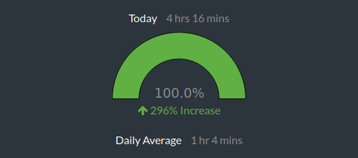

# 100 Days Of Code - Log

## Day 1: May 1, 2017

**Active Coding Time:** 4 hours, 16 minutes

**Commits:** 14

### Thoughts: 
The past month has been a whirlwind, but I'm officially rebooting the #100DaysOfCode challenge again. This time, I will make a concerted effort to not only code for an hour every day, but to make at least one commit every day, and to utilize [WakaTime](https://wakatime.com) to measure my code-editing time.

As far as measurable metrics went, today was a great start. 10 commits counted towards today, as well as 4 commits on a branch that hasn't been merged yet. According to WakaTime, I've actively edited code for 4 hours and 16 minutes today.

The work I'm doing now is pretty interesting. I got a really basic Ruby gem made and added to [RubyGems](https://rubygems.org/gems/chznbaum_view_tool), and I'm getting to a point in my portfolio resign where I can start working with the styles since the functionality in Ruby is just about there.

### Work:
* View Tool (Ruby):
  * Pushed changes to [GitHub](https://github.com/chznbaum/chznbaum_view_tool) and [RubyGems](https://rubygems.org/gems/chznbaum_view_tool)
* Portfolio (Ruby on Rails):
  * Implemented my basic Ruby gem to generate the footer copyright content.
  * Implemented authorization through [petergate](https://rubygems.org/gems/petergate) to restrict certain items and actions to certain users.
  * Setup master layout styles and helper methods, as well as implementing embedded Google Map on contact page.
  * Pushed changes (except current branch) to [GitHub](https://github.com/chznbaum/rails-portfolio). It will still be a while before it gets deployed to production and viewed live.

## Day 2: May 2, 2017

**Active Coding Time:** 6 hours, 23 minutes

**Commits:** 12

### Thoughts: 
Pressed to get the initial styles of the app done, even if it took working well past midnight. In the process, managed to get the next day's requirements done.

### Work:
* Portfolio (Ruby on Rails):
  * Implemented initial styling of user pages
  * Established layouts with initial styling for default, blogs, and portfolio
  * Implemented partials for navs, mastheads, modules, and footers

## Day 3: May 3, 2017

**Active Coding Time:** 1 hour, 23 minutes

**Commits:** 5

### Thoughts: 
Finished shortly before 2 in the morning and went to bed exhausted. More thoughts to come.

### Work:
* Portfolio (Ruby on Rails):
  * Implemented styles for portfolio show page and forms
  * Refactored navigation and active statuses
  * Merged design branch to GitHub master