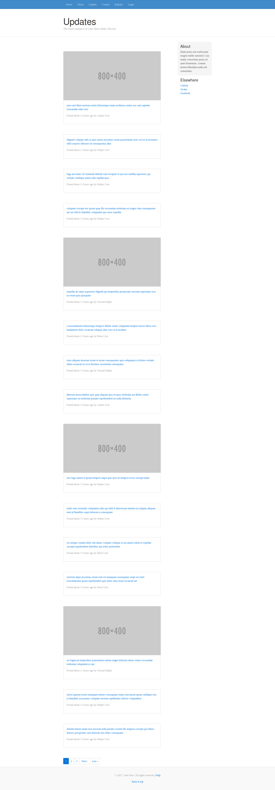

# 100 Days Of Code - Log

## Day 1: May 1, 2017

**Active Coding Time:** 4 hours, 16 minutes

**Commits:** 14

### Thoughts: 
The past month has been a whirlwind, but I'm officially rebooting the #100DaysOfCode challenge again. This time, I will make a concerted effort to not only code for an hour every day, but to make at least one commit every day, and to utilize [WakaTime](https://wakatime.com) to measure my code-editing time.

As far as measurable metrics went, today was a great start. 10 commits counted towards today, as well as 4 commits on a branch that hasn't been merged yet. According to WakaTime, I've actively edited code for 4 hours and 16 minutes today.

The work I'm doing now is pretty interesting. I got a really basic Ruby gem made and added to [RubyGems](https://rubygems.org/gems/chznbaum_view_tool), and I'm getting to a point in my portfolio resign where I can start working with the styles since the functionality in Ruby is just about there.

### Work:
* View Tool (Ruby):
  * Pushed changes to [GitHub](https://github.com/chznbaum/chznbaum_view_tool) and [RubyGems](https://rubygems.org/gems/chznbaum_view_tool)
* Portfolio (Ruby on Rails):
  * Implemented my basic Ruby gem to generate the footer copyright content.
  * Implemented authorization through [petergate](https://rubygems.org/gems/petergate) to restrict certain items and actions to certain users.
  * Setup master layout styles and helper methods, as well as implementing embedded Google Map on contact page.
  * Pushed changes (except current branch) to [GitHub](https://github.com/chznbaum/rails-portfolio). It will still be a while before it gets deployed to production and viewed live.

## Day 2: May 2, 2017

**Active Coding Time:** 6 hours, 23 minutes

**Commits:** 12

### Thoughts: 
Pressed to get the initial styles of the app done, even if it took working well past midnight. In the process, managed to get the next day's requirements done.

### Work:
* Portfolio (Ruby on Rails):
  * Implemented initial styling of user pages
  * Established layouts with initial styling for default, blogs, and portfolio
  * Implemented partials for navs, mastheads, modules, and footers

## Day 3: May 3, 2017

**Active Coding Time:** 2 hours, 25 minutes

**Commits:** 5

### Thoughts: 
Finished shortly before 2 in the morning and went to bed exhausted. More thoughts to come.

### Work:
* Portfolio (Ruby on Rails):
  * Implemented styles for portfolio show page and forms
  * Refactored navigation and active statuses
  * Merged design branch to GitHub master

## Day 4: May 4, 2017

**Active Coding Time:** 2 hours, 19 minutes

**Commits:** 14

### Thoughts: 
Life tends to get...complicated.

My sister is apparently expecting, and about six months along at that. So I'm now getting a site set up that she can use for her baby shower and communicating updates with family and friends. In for a lot of work to be done in a relatively short period of time.

Today, I focused on configuring the application, establishing the static pages and setting up some preliminary layout and styles:

The static pages will change some once the really dynamic content is set up, but it's a good place to start.

Prior to working on setting the baby shower website up, I took a look at Docker and did some practice with dockerizing a Ruby app. Definitely needs work, but I can see why it's so often recommended.

### Work:
* Baby Shower (Ruby on Rails):
  * Generated app and pages controller
  * Configured the app and database
  * Implemented the preliminary layout and styles for static pages

## Day 5: May 5, 2017

**Active Coding Time:** 9 hours, 15 minutes

**Commits:** 53

### Thoughts:
Ok, so there's not too much time to get this baby shower site together. My sister only recently discovered she's expecting, and she's already about 6 months along. So there will probably be a lot of heavy-duty coding days while I sprint to get this finished in time to use it for the baby shower.

Today, I packed in over 9 hours of active code editing time, and it showed with a lot of progress:

The first feature to build was the updates feature, like a microblogging section for the mom-to-be and her helpers to share news, photos, etc., involving the pregnancy, shower, and baby:

After knocking out the basics of the updates feature, which will change with the addition of comments, etc., I got started on authentication and authorization.

### Work:
* Baby Shower (Ruby on Rails):
  * Implemented updates feature, including:
    * Scaffolding CRUD functionality
    * Implementing custom layout
    * Seeding sample data
    * Implementing custom styles
    * Customizing titles
    * Implementing pagination
  * Implemented authentication, including:
    * Installing and configuring devise
    * Customizing routes
    * Implementing dynamic view rendering for authentication with a view helper
    * Adding custom parameters for registration and editing account
    * Adding concern for devise params
    * Integrating helper method from ActionView
    * Adding guest user that inherits from devise user
    * Implementing custom styles for authentication and editing pages
  * Implemented authorization engine for updates using petergate
  * Implemented relationship between users and their updates, including:
    * Adding reference to updates table
    * Reseeding database with sample data
    * Implementing relationship in views, forms
    * Adding avatars to users
